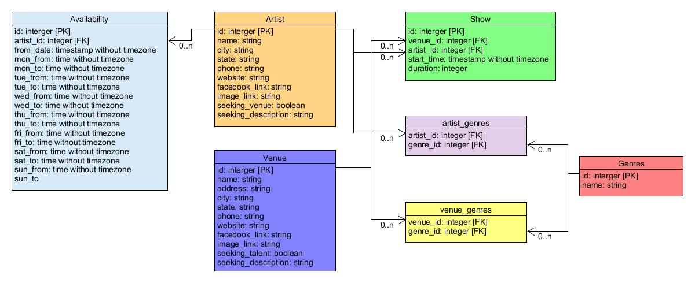

Fyyur
-----

# Table of Contents
- [Table of Contents](#table-of-contents)
  - [Introduction](#introduction)
  - [Overview](#overview)
  - [Tech Stack (Dependencies)](#tech-stack-dependencies)
    - [1. Backend Dependencies](#1-backend-dependencies)
    - [2. Frontend Dependencies](#2-frontend-dependencies)
  - [Main Files: Project Structure](#main-files-project-structure)
  - [Instructions](#instructions)
  - [Acceptance Criteria](#acceptance-criteria)
    - [Stand Out](#stand-out)
  - [Development Setup](#development-setup)
      - [1. Download the project starter code locally](#1-download-the-project-starter-code-locally)
      - [2. Create an empty repository in your Github account online](#2-create-an-empty-repository-in-your-github-account-online)
      - [3. Initialize and activate a virtualenv](#3-initialize-and-activate-a-virtualenv)
      - [4. Install the dependencies:](#4-install-the-dependencies)
      - [5. Run the development server:](#5-run-the-development-server)
      - [6. Verify on the Browser](#6-verify-on-the-browser)
  - [Implementation](#implementation)
    - [Features](#features)
    - [Database schema](#database-schema)
    - [Database setup](#database-setup)
      - [Configuration](#configuration)
      - [Migration](#migration)
      - [Load sample data](#load-sample-data)
    - [Testing](#testing)


## Introduction

Fyyur is a musical venue and artist booking site that facilitates the discovery and bookings of shows between local performing artists and venues. This site lets you list new artists and venues, discover them, and list shows with artists as a venue owner.

Your job is to build out the data models to power the API endpoints for the Fyyur site by connecting to a PostgreSQL database for storing, querying, and creating information about artists and venues on Fyyur.

Original base code available at https://github.com/udacity/FSND/tree/master/projects/01_fyyur/starter_code as part of [Full Stack Web Developer Nanodegree](https://www.udacity.com/course/full-stack-web-developer-nanodegree--nd0044) by Udacity.

## Overview

This app is nearly complete. It is only missing one thing… real data! While the views and controllers are defined in this application, it is missing models and model interactions to be able to store retrieve, and update data from a database. By the end of this project, you should have a fully functioning site that is at least capable of doing the following, if not more, using a PostgreSQL database:

* creating new venues, artists, and creating new shows.
* searching for venues and artists.
* learning more about a specific artist or venue.

We want Fyyur to be the next new platform that artists and musical venues can use to find each other, and discover new music shows. Let's make that happen!

## Tech Stack (Dependencies)

### 1. Backend Dependencies
Our tech stack will include the following:
 * **virtualenv** as a tool to create isolated Python environments
 * **SQLAlchemy ORM** to be our ORM library of choice
 * **PostgreSQL** as our database of choice
 * **Python3** and **Flask** as our server language and server framework
 * **Flask-Migrate** for creating and running schema migrations
You can download and install the dependencies mentioned above using `pip` as:
```shell
pip install virtualenv
pip install SQLAlchemy
pip install postgres
pip install Flask
pip install Flask-Migrate
```
> **Note** - If we do not mention the specific version of a package, then the default latest stable package will be installed. 

> **Note** - If using a virtualenv, SQLAlchemy etc. should be installed after the *Initialize and activate a virtualenv* step in [Development Setup](#development-setup).

### 2. Frontend Dependencies
You must have the **HTML**, **CSS**, and **Javascript** with [Bootstrap 3](https://getbootstrap.com/docs/3.4/customize/) for our website's frontend. Bootstrap can only be installed by Node Package Manager (NPM). Therefore, if not already, download and install the [Node.js](https://nodejs.org/en/download/). Windows users must run the executable as an Administrator, and restart the computer after installation. After successfully installing the Node, verify the installation as shown below.
```
node -v
npm -v
```
Install [Bootstrap 3](https://getbootstrap.com/docs/3.3/getting-started/) for the website's frontend:
```
npm init -y
npm install bootstrap@3
```


## Main Files: Project Structure

  ```sh
  ├── README.md
  ├── app.py           *** the main driver of the app.
                    "python app.py" to run after installing dependences
  ├── config.py        *** application configuration
  ├── secrets.py       *** Database URLs, see [Database setup](#database-setup)
  ├── error.log
  ├── requirements.txt *** The dependencies to be installed with "pip3 install -r requirements.txt"
  ├── controllers      *** controllers handling requests
  │   └── ... 
  ├── forms            *** forms and related code
  │   └── ... 
  ├── migrations       *** Flask-Migrate files
  │   └── ... 
  ├── models           *** SQLAlchemy models & related code
  │   └── ... 
  ├── static
  │   ├── css 
  │   ├── font
  │   ├── ico
  │   ├── img
  │   └── js
  ├── templates
  │   ├── errors
  │   ├── forms
  │   ├── layouts
  │   └── pages
  └── test            *** test related files
      └── ... 
  ```

Overall:
* Models are located in the [models](models) folder.
* Controllers are located in the [controllers](controllers) folder.
* The web frontend is located in `templates/`, which builds static assets deployed to the web server at `static/`.
* Web forms for creating data are located in the [forms](forms) folder.


Highlight folders:
* `templates/pages` -- (Already complete.) Defines the pages that are rendered to the site. These templates render views based on data passed into the template’s view, in the controllers defined in `app.py`. These pages successfully represent the data to the user, and are already defined for you.
* `templates/layouts` -- (Already complete.) Defines the layout that a page can be contained in to define footer and header code for a given page.
* `templates/forms` -- (Already complete.) Defines the forms used to create new artists, shows, and venues.
* `app.py` -- (Missing functionality.) Defines routes that match the user’s URL, and controllers which handle data and renders views to the user. This is the main file you will be working on to connect to and manipulate the database and render views with data to the user, based on the URL.
* Models in `app.py` -- (Missing functionality.) Defines the data models that set up the database tables.
* `config.py` -- Stores configuration variables and instructions, separate from the main application code. This is where you will need to connect to the database.
* `secret.py` -- This is where the database configuration is set. See [Database setup](#database-setup) for details.


Instructions
-----

1. Understand the Project Structure (explained above) and where important files are located.
2. Build and run local development following the Development Setup steps below.
3. Fill in the missing functionality in this application: this application currently pulls in fake data, and needs to now connect to a real database and talk to a real backend.
3. Fill out every `TODO` section throughout the codebase. We suggest going in order of the following:

  1. Connect to a database in `config.py`. A project submission that uses a local database connection is fine.
  2. Using SQLAlchemy, set up normalized models for the objects we support in our web app in the Models section of `app.py`. Check out the sample pages provided at /artists/1, /venues/1, and /shows/1 for examples of the data we want to model, using all of the learned best practices in database schema design. Implement missing model properties and relationships using database migrations via Flask-Migrate.
  3. Implement form submissions for creating new Venues, Artists, and Shows. There should be proper constraints, powering the `/create` endpoints that serve the create form templates, to avoid duplicate or nonsensical form submissions. Submitting a form should create proper new records in the database.
  4. Implement the controllers for listing venues, artists, and shows. Note the structure of the mock data used. We want to keep the structure of the mock data.
  5. Implement search, powering the `/search` endpoints that serve the application's search functionalities.
  6. Serve venue and artist detail pages, powering the `<venue|artist>/<id>` endpoints that power the detail pages.


Acceptance Criteria
-----

1. The web app should be successfully connected to a PostgreSQL database. A local connection to a database on your local computer is fine.
2. There should be no use of mock data throughout the app. The data structure of the mock data per controller should be kept unmodified when satisfied by real data.
3. The application should behave just as before with mock data, but now uses real data from a real backend server, with real search functionality. For example:
  * when a user submits a new artist record, the user should be able to see it populate in /artists, as well as search for the artist by name and have the search return results.
  * I should be able to go to the URL `/artist/<artist-id>` to visit a particular artist’s page using a unique ID per artist, and see real data about that particular artist.
  * Venues should continue to be displayed in groups by city and state.
  * Search should be allowed to be partial string matching and case-insensitive.
  * Past shows versus Upcoming shows should be distinguished in Venue and Artist pages.
  * A user should be able to click on the venue for an upcoming show in the Artist's page, and on that Venue's page, see the same show in the Venue Page's upcoming shows section.
4. As a fellow developer on this application, I should be able to run `flask db migrate`, and have my local database (once set up and created) be populated with the right tables to run this application and have it interact with my local postgres server, serving the application's needs completely with real data I can seed my local database with.
  * The models should be completed (see TODOs in the `Models` section of `app.py`) and model the objects used throughout Fyyur.
  * The right _type_ of relationship and parent-child dynamics between models should be accurately identified and fit the needs of this particular application.
  * The relationship between the models should be accurately configured, and referential integrity amongst the models should be preserved.
  * `flask db migrate` should work, and populate my local postgres database with properly configured tables for this application's objects, including proper columns, column data types, constraints, defaults, and relationships that completely satisfy the needs of this application. The proper type of relationship between venues, artists, and shows should be configured.

### Stand Out

Looking to go above and beyond? This is the right section for you! Here are some challenges to make your submission stand out:

*  Implement artist availability. An artist can list available times that they can be booked. Restrict venues from being able to create shows with artists during a show time that is outside of their availability.
* Show Recent Listed Artists and Recently Listed Venues on the homepage, returning results for Artists and Venues sorting by newly created. Limit to the 10 most recently listed items.
* Implement Search Artists by City and State, and Search Venues by City and State. Searching by "San Francisco, CA" should return all artists or venues in San Francisco, CA.

Best of luck in your final project! Fyyur depends on you!


## Development Setup
#### 1. Download the project starter code locally
```shell
git clone https://github.com/udacity/FSND.git
cd FSND/projects/01_fyyur/starter_code 
```

#### 2. Create an empty repository in your Github account online
To change the remote repository path in your local repository, use the commands below:
```shell
git remote -v 
git remote remove origin 
git remote add origin <https://github.com/<USERNAME>/<REPO_NAME>.git>
git branch -M master
```
Once you have finished editing your code, you can push the local repository to your Github account using the following commands.
```shell
git add . --all   
git commit -m "your comment"
git push -u origin master
```

#### 3. Initialize and activate a virtualenv
Use the following commands:
```shell
python -m virtualenv env
source env/bin/activate
```
>**Note** - In Windows, the `env` does not have a `bin` directory. Therefore, you'd use the analogous command shown below:
```shell
env/Scripts/activate
```

#### 4. Install the dependencies:
```shell
pip install -r requirements.txt
```

#### 5. Run the development server:

In linux:
```shell
export FLASK_APP=app
export FLASK_ENV=development # enables debug mode
python3 app.py
```
In windows:
```shell
set FLASK_APP=app
set FLASK_ENV=development # enables debug mode
python3 app.py
```

#### 6. Verify on the Browser
Navigate to project homepage [http://127.0.0.1:5000/](http://127.0.0.1:5000/) or [http://localhost:5000](http://localhost:5000) 

## Implementation
### Features
* Application structure re-organised to improve maintainability, see [Main Files: Project Structure](#main-files-project-structure) for details.
* Application works in either of two modes:
  * *SQLAlchemy ORM*

    Pure Object–relational mapping functionality.
  * *SQLAlchemy Engine*

    SQLAlchemy Engine functionality utilising SQL.

  To switch between the different modes, set `CONNECTION_MODE` to `ORM_CONNECTION` or `ENGINE_CONNECTION` as required in [config.py](config.py)

  **Note:** *Flask-Migrate functionality is only available in ORM mode.*

* Artist time availability, has been implemented allowing an artist to specify an available time slot for each day of the week.

* Show listing conflict functionality has been implemented to prevent the listing of a show if venue or artist unavailability arises.

* Three search modes are implemented for artists and venues:
  * *Basic*

    Name/partial name search from the search box in the page header.

  * *City/State*

    City/partial city/state search from the search box in the page header. The search term must be specified as `city, state` in the search box in the page header.
  
  * *Advanced*

    Available from the artists and venues pages by clicking on `Advanced Search`. Allows searching by any combination of name/partial name, city/partial city and state.

* Recently listed artists and venues are available on the homepage.

### Database schema
The following database schema has been implemented:


### Database setup
#### Configuration

Create a copy of [secrets-sample.py](secrets-sample.py), update it with the database details, and save it as `secrets.py` in the project root folder. 

  E.g.
  ```sh
  SERVER = 'localhost'
  PORT = '5432'
  DATABASE = 'fyyur'
  USERNAME = 'username'
  PASSWORD = 'password'
  ```

#### Migration
Once a blank database, as specified in [Database setup](#database-setup) is available, it may be prepared for the application as follows:

* Open a terminal in the project root folder and activate the project python environment, see [Initialize and activate a virtualenv](#3-initialize-and-activate-a-virtualenv).
* Run the command `flask db upgrade` or `python -m flask db upgrade` 

  This will configure the database to the state required by the application, using the script [c55ec6b7a0a1_.py](migrations/versions/c55ec6b7a0a1_.py).

* Run the command `flask db upgrade` or `python -m flask db upgrade` again

  This will configure the database to the state corresponding to the base code, using the script [f8fe5c0c244c_.py](migrations/versions/f8fe5c0c244c_.py).

#### Load sample data
The sample data as provided in the base code may be loaded using the script [load_initial_data.py](load_initial_data.py)

### Testing
The [Udacity FSWD Fyyur.postman_collection.json](test/Udacity%20FSWD%20Fyyur.postman_collection.json) contains a [Postman](https://www.postman.com/) Collection which may be utilised to perform some basic application testing.

**Note:** *The requests are intended to be run in the listed order. Requests out of sequence may fail.*
